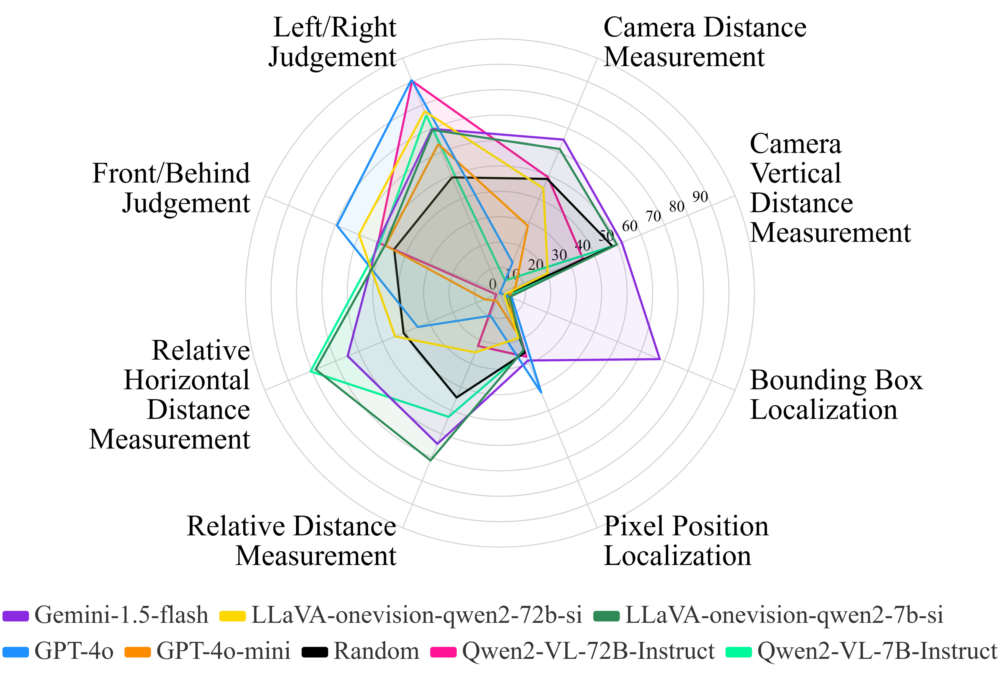

# DriveMLLM: A Benchmark for Spatial Understanding with Multimodal Large Language Models in Autonomous Driving

### [Paper](https://arxiv.org/abs/2411.13112)

> [DriveMLLM: A Benchmark for Spatial Understanding with Multimodal Large Language Models in Autonomous Driving](https://arxiv.org/abs/2411.13112)

> [Xianda Guo*](https://scholar.google.com/citations?user=jPvOqgYAAAAJ), Ruijun Zhang*, [Yiqun Duan*](https://scholar.google.com.hk/citations?user=NmwjI0AAAAAJ&hl=zh-CN), Yuhang He, Chenming Zhang, Long Chen.

## News 
- **[2024/11]** Paper released on [arXiv](https://arxiv.org/abs/2411.13112).

## Overall


## Getting Started

### 0. Prepare Dataset

We are using the Hugging Face dataset [DriveMLLM](https://huggingface.co/datasets/bonbon-rj/DriveMLLM) for evaluation. The images are sourced from the validation set of [nuScenes](https://www.nuscenes.org/). We have provided a `metadata.jsonl` file for all images, allowing users to easily access properties such as `bboxes2D`.


### 1. [Setup Environment](docs/EnvironmentSetup.md)

### 2. VQAs generation

Run the following code to download the dataset, generate the VQAs, and save them in the `eval_vqas` folder.
```shell
python hfdata_to_eval_vqa.py \
--hf_dataset bonbon-rj/DriveMLLM \
--vqas_save_dir eval_vqas
```

### 3. Inference

Run inference according to your requirements:
- For GPT API calls:

```shell
export OPENAI_API_KEY=your_api_key

python inference/get_mllm_output.py \
--model_type gpt \
--model gpt-4o \
--vqas_dir eval_vqas \
--save_dir inference/mllm_outputs
```

- For Gemini API calls:

```shell
export GOOGLE_API_KEY=your_api_key

python inference/get_mllm_output.py \
--model_type gemini \
--model models/gemini-2.0-flash \
--vqas_dir eval_vqas \
--save_dir inference/mllm_outputs
```

- For Local LLaVA-Next inference:
```shell
python inference/get_mllm_output.py \
--model_type llava \
--model lmms-lab/llava-onevision-qwen2-7b-si \
--vqas_dir eval_vqas \
--save_dir inference/mllm_outputs
```

- For Local QWen2.5-VL inference:
```shell
python inference/get_mllm_output.py \
--model_type qwen \
--model Qwen/Qwen2.5-VL-7B-Instruct \
--vqas_dir eval_vqas \
--save_dir inference/mllm_outputs
```

After executing the script, the results will be saved in the directory: `{save_dir}/{model_type}/{model}`.


## Citation
```
@article{DriveMLLM,
        title={DriveMLLM: A Benchmark for Spatial Understanding with Multimodal Large Language Models in Autonomous Driving},
        author={Guo, Xianda and Zhang Ruijun and Duan Yiqun and He Yuhang and Zhang, Chenming and Chen, Long},
        journal={arXiv preprint arXiv:2411.13112},
        year={2024}
}
```
